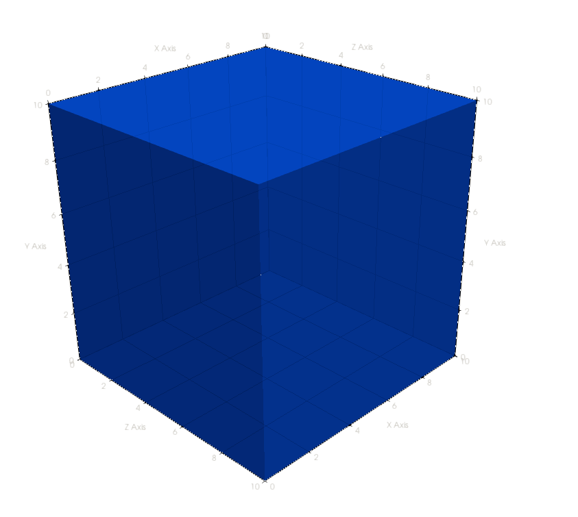
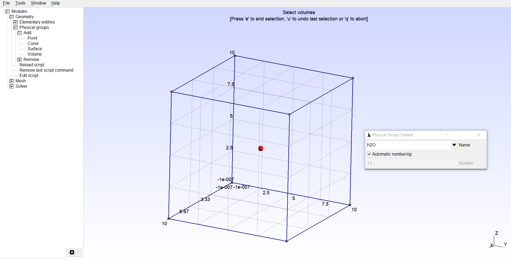
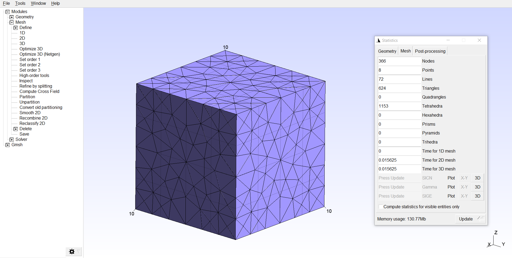

# Generate an input mesh

Before creating a mesh, we have decide what we want to simulate. This can range from a single tetrahedron to a multi-million element mesh derived from a CAD file. For this example, we're going to simulate a cube of water. The cube will have side lengths of 10cm for a total volume of 1000 cm³.

<p align="center">
	
</p>

## Creating the geometry using Gmsh

> For this example, we're going to create the geometry in Gmsh directly. However, it's also possible to define our geometry in CAD, export it to STEP, and then use Gmsh to mesh the STEP file without having to model geometries in Gmsh.

First, open Gmsh. Create a new script file using `File->New` called `cube.geo`. If prompted, use the `OpenCASCADE` geometry kernel. Create a 10cm cube using:

**`Geometry->Elementary entities->Add->Box`**

After adding the box, hit the `q` key to quit the box dialog. Gmsh is unitless, so a length of 10 could have any unit attached. By default, `EGS_Mesh` assumes Gmsh input files are given in cm.


## Assigning mesh media

Now, we have our cube geometry. But how will EGSnrc know it's made of water? We also have to assign material names to each volume. These will be read in by `EGS_Mesh` and each tetrahedron will be assigned the corresponding medium. Media names are specified using Gmsh `Physical Volumes`. Open the `Physical Volumes` dialog using:

**`Geometry->Physical groups->Add->Volume`**

In the `Name` input, enter `H2O` for water. Select the volume using the mouse, and the yellow sphere at the center of the cube should turn red. End the selection by pressing the `e` key, and then hit the `q` key to exit the volume dialog entirely.



## Meshing the geometry
Now, we have a geometry with media names attached. All that's left is to mesh the geometry. You can create a 3D mesh using:

**`Mesh->3D`**



After creating the mesh, you can find information like the number of tetrahedrons using `Tools->Statistics`. The mesh shown here has 1153 elements. Mesh visibility settings are in `Tools->Options->Mesh->Visibility`.

Write the mesh to disk using:

**`File->Save Mesh`**

Only ASCII v4.1 `msh` files are currently supported in `EGS_Mesh`. You can open up the file in a text editor to check the details:

```text
$MeshFormat
4.1 0 8
$EndMeshFormat
$PhysicalNames
1
3 1 "H2O"
$EndPhysicalNames
... // continued
```

Here, the format version is confirmed to be 4.1, and the only media name is `H2O`. Further on in the file, node coordinates and element nodes are also stored. The `msh` format is documented [here](http://gmsh.info/doc/texinfo/gmsh.html#MSH-file-format). 

With a fresh input mesh file in hand, we're ready to write an EGSnrc input file.
