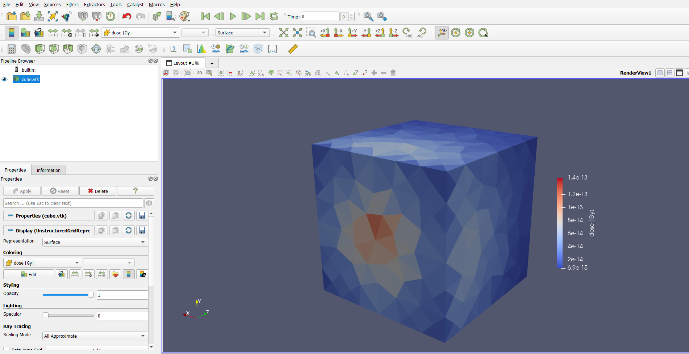

# Run the simulation and view the results

To run the simulation, you'll use the `mevegs` EGSnrc user code, which outputs the results to a VTK file to be analyzed in Paraview.

> As an `egs++` geometry, `EGS_Mesh` is technically usable from any `egs++` application. But `mevegs` converts `EGS_Mesh` results to VTK for quick analysis without any extra steps.

Back when you created the mesh file, you also assigned media names. In this example, the only media was `H2O`, but simulations can have many different media. For all mesh media, you have to ensure that EGSnrc has the corresponding data loaded. This can either be done by specifying a `pegs4dat` file using the `-p` flag on the command line, or defining the media in the input file. Either method is fine, but for this example you'll use a `pegs4dat` file. The file `tutor_data.pegs4dat` comes bundled with EGSnrc and has a definition of `H2O`.

Enter the `mevegs` directory in `egs_home` and run the simulation:

`mevegs -i cube.egsinp -p tutor_data.pegs4dat`

Make sure the `cube.msh` file is in the same directory you're running the code in.

EGSnrc will print a few screens of information to the console and then report simulation progress until it's done. 

```text
Running 1000000 histories

  Batch             CPU time        Result   Uncertainty(%)
==========================================================
      1                2.30     0.00470093           2.36
      2                4.82     0.00483381           1.67
      3                6.94     0.00481503           1.36
      4                9.03     0.00479555           1.18
      5               11.21      0.0047708           1.06
      6               13.44     0.00474837           0.96
      7               15.91     0.00473835           0.89
      8               17.97     0.00475373           0.83
      9               20.32     0.00476651           0.79
     10               22.21     0.00474332           0.75


Finished simulation

Total cpu time for this run:            22.21 (sec.) 0.0062(hours)
Histories per hour:                     1.62089e+08
Number of random numbers used:          295050812
Number of electron CH steps:            1.43683e+07
Number of all electron steps:           2.24998e+07


 last case = 2429137 Etot = 1e+07


================================================================================
Finished simulation

  Elapsed time:                   26.0 s (  0.007 h)
  CPU time:                       25.7 s (  0.007 h)
  Ratio:                          1.015
```

Afterwards, there should be a new file called `cube.vtk`. Start Paraview and open this file using `File->Open`, and `Apply` in the `Properties` toolbar. Color the mesh by `dose` to see the dose results.



And you're done! That's a full `EGS_Mesh` simulation from start to finish. Color the mesh by `uncertainty` to see whether these results can be trusted, or if you need to run more histories to be sure. 

### Going further

1. Refine the mesh and run another simulation. How did the simulation runtime change? Do the results look different? More refined meshes are required to observe accurate dose gradients.

2. After the simulation, the histories per hour is reported. Run a simulation with more histories and check if the histories per hour changes. Given this number, how long would it take you to run one billion histories?

3. Run an `EGS_XYZGeometry` simulation with a similar number of elements and compare the simulation runtimes. Typically, `EGS_Mesh` simulations are 2 to 3 times slower than `EGS_XYZGeometry`. Do you observe this? How do the results compare?

4. The dose result is fairly uneven, especially for coarse meshes like this one. Why? Does this persist if you keep refining the mesh?

### References

* [EGSnrc home page](https://nrc-cnrc.github.io/EGSnrc/)
* [EGSnrc `egs++` library manual](https://nrc-cnrc.github.io/EGSnrc/doc/pirs898/)
* [Gmsh reference manual](https://gmsh.info/doc/texinfo/gmsh.html)
* [Paraview manual](https://docs.paraview.org/en/latest/)
