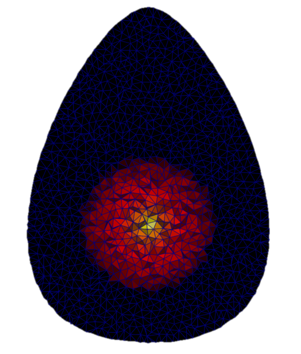
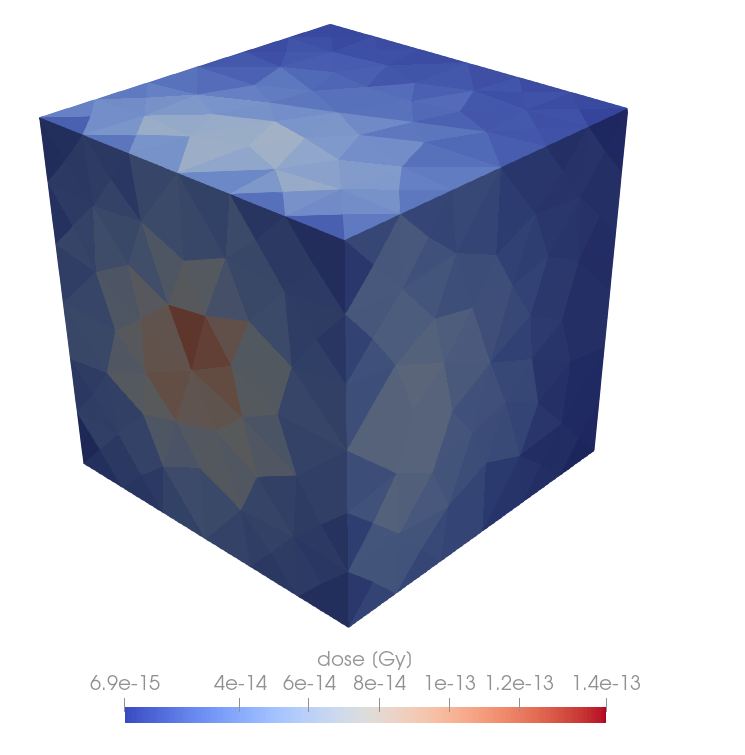

# EGS_Mesh

`EGS_Mesh` is a general-purpose unstructured tetrahedral mesh library for [EGSnrc](https://nrc-cnrc.github.io/EGSnrc/).

`EGS_Mesh` offers modelling flexibility over traditional voxel-based simulations. Instead of building up a geometry using a constructive-solid approach, `EGS_Mesh` takes a tetrahedral mesh file as input. Tetrahedral meshes can accurately model complex geometries with fewer elements compared to hexahedral voxels. Geometries created in CAD can be meshed and then simulated directly. `EGS_Mesh` uses the Gmsh `msh` format as mesh input. Users can generate meshes using the standalone tool [Gmsh](https://gmsh.info/), or create a `msh` file from their data.

	
	

If you're new to `EGS_Mesh`, you can work through a [guided example](./example/example.md). You can also consult the [`egsinp` syntax reference](./egsinp_syntax.md). If you want to simulate STEP files using `EGS_Mesh`, check out the [STEP file example](./step/step.md).

<!---
## Credits

`EGS_Mesh` was created and open-sourced by [Mevex Corporation](https://www.mevex.com/). The code is maintained by the Canadian National Research Council as part of [EGSnrc](https://github.com/nrc-cnrc/EGSnrc).
-->

## Alternatives 
Other Monte Carlo codes that support tetrahedral mesh simulations include:
* [Geant4](https://geant4.web.cern.ch/) 
* [MCNP6](https://mcnp.lanl.gov/)
* [PHITS](https://phits.jaea.go.jp/)
